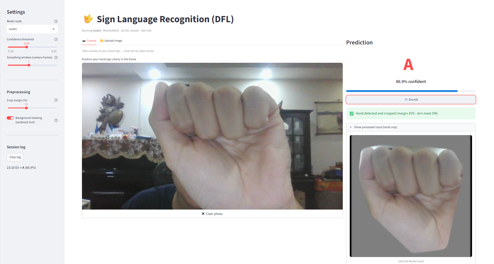

# DFL Sign-to-Speech: Decentralized Federated Learning for ASL Recognition

[](https://www.python.org/)
[](https://www.tensorflow.org/)
[](https://www.docker.com/)
[](https://grpc.io/)
[](https://streamlit.io/)

> **VGU · Year 3 · Semester 2 · Distributed Systems Project (Group 2)**  
> A privacy-preserving, distributed machine learning system where **5 autonomous Docker nodes** collaboratively train a Convolutional Neural Network (CNN) model to recognize American Sign Language (ASL) hand gestures without centralizing raw images. Recognized signs are automatically converted into spoken audio using an integrated Text-to-Speech (TTS) engine.

---

## 📸 System Demonstration & Results

The system features an interactive **Streamlit GUI** (`app_tester.py`) allowing users to upload hand gesture images, select individual node models or ensemble models, visualize prediction probabilities, and hear the spoken output.



### What You See Above:
* **Image Upload & Preprocessing**: Upload ASL hand images for instant classification.
* **Model Selection**: Switch between individual decentralized nodes or aggregate ensemble weights.
* **Prediction Confidence**: Detailed probability breakdown per ASL alphabet class.
* **Text-to-Speech (TTS) Output**: Built-in audio synthesis to pronounce recognized signs aloud.

---

## ✨ Key Features

- **🔒 Privacy-Preserving (FedAvg)**: No raw images leave local nodes; only model weight parameters are exchanged across peers using Federated Averaging.
- **🌐 Decentralized Peer-to-Peer Mesh**: 5 autonomous Docker nodes communicate directly via gRPC without relying on a single point of failure (central server).
- **🗣️ Sign-to-Speech Engine**: Converts predicted sign gestures directly into speech audio via `gTTS` and `pyttsx3`.
- **🎛️ Interactive GUI Dashboard**: Full testing interface built with Streamlit for model inspection, live prediction, and audio playback.
- **⚡ Asynchronous & Fault-Tolerant**: Nodes gossip weights asynchronously over a custom gRPC protocol—slow or offline peers do not block training.

---

## 💻 Tech Stack

| Category | Technology | Role in System |
| :--- | :--- | :--- |
| **Machine Learning** |   | CNN deep learning model for ASL gesture recognition |
| **Containerization** |   | Orchestrates 5 isolated container nodes on a custom Docker network |
| **Networking & RPC** |   | High-performance peer-to-peer weight gossip protocol |
| **Federated Learning** | **Decentralized FedAvg** | Aggregates node weight parameters ($\sum n_i w_i / \sum n_i$) without central servers |
| **User Interface** |  | Frontend web application for uploading images, selecting models, and viewing output |
| **Audio Synthesis** | `gTTS` / `pyttsx3` | Converts predicted sign letters into spoken voice audio |
| **Computer Vision** | `OpenCV` / `Pillow` / `NumPy` | Preprocessing, resizing, normalization, and image data pipeline |
| **Core Language** |  | Primary programming language |

---

## 🏗️ Architecture & System Flow

```
┌─────────────────────────────────────────────────────────────────────────┐
│                       Docker Network (dfl-net)                          │
│                                                                         │
│   ┌───────────┐     gRPC Gossip      ┌───────────┐     gRPC Gossip      │
│   │  Node 1   │◄────────────────────►│  Node 3   │◄────────────────────►│
│   │ CNN Model │                      │ CNN Model │                      │
│   │ Shard 1   │                      │ Shard 3   │                      │
│   └───────────┘                      └───────────┘                      │
│         ▲                                  ▲                            │
│         │ gRPC Gossip          gRPC Gossip │                            │
│         ▼                                  ▼                            │
│   ┌───────────┐     gRPC Gossip      ┌───────────┐                      │
│   │  Node 2   │◄────────────────────►│  Node 4   │◄───┐                 │
│   │ CNN Model │                      │ CNN Model │    │                 │
│   │ Shard 2   │                      │ Shard 4   │    │ gRPC Gossip     │
│   └───────────┘                      └───────────┘    │                 │
│                                                       ▼                 │
│                                                 ┌───────────┐           │
│                                                 │  Node 5   │           │
│                                                 │ CNN Model │           │
│                                                 │ Shard 5   │           │
│                                                 └───────────┘           │
└─────────────────────────────────────┬───────────────────────────────────┘
                                      │
                                      ▼
                        ┌───────────────────────────┐
                        │   Streamlit GUI Frontend  │
                        │     (app_tester.py)       │
                        └───────────────────────────┘
```

### Federated Learning Cycle (Per Node):
1. **Local Training**: Each node trains its local CNN model on its private data shard.
2. **Weight Serialization**: Local model weights are flattened into a `float32` byte array.
3. **P2P Gossip**: Nodes send their weights to random peer nodes via gRPC (`GossipWeights` RPC).
4. **FedAvg Aggregation**: Received weights are aggregated using weighted Federated Averaging:
   $$W_{\text{global}} = \frac{\sum_{i} n_i \cdot W_i}{\sum_{i} n_i}$$
5. **Model Update**: The aggregated weights are applied back to the local model for the next round.

---

## 🛠️ Prerequisites & Installation

Before running the application, ensure you have installed:
* [Docker Desktop](https://www.docker.com/products/docker-desktop/) (must be running)
* [Python 3.11](https://www.python.org/downloads/)
* Git

---

## 🚀 Quick Start Guide

### Step 1: Clone the Repository
```powershell
git clone <YOUR_REPOSITORY_URL>
cd "DistributedSystemProject Group2"
```

### Step 2: Set Up Python Virtual Environment
```powershell
# Create virtual environment
python -m venv venv

# Activate on Windows PowerShell:
.\venv\Scripts\Activate.ps1

# Install required dependencies
pip install -r dfl-sign-to-speech/requirements.txt
```

> [!NOTE]
> If you moved your project directory and encounter `Unable to create process` errors with `streamlit`, run:
> `python -m pip install --force-reinstall --no-deps streamlit`

### Step 3: Launch Decentralized Docker Nodes
Navigate to the `dfl-sign-to-speech` directory and start the 5 Docker nodes:
```powershell
cd dfl-sign-to-speech
docker compose up -d
```
Verify that all 5 nodes are running:
```powershell
docker ps
```

### Step 4: Launch the Streamlit GUI
Start the user interface application:
```powershell
# From inside dfl-sign-to-speech directory:
streamlit run app_tester.py

# Alternatively, using python directly:
python -m streamlit run app_tester.py
```
Open your browser at `http://localhost:8501`.

### Step 5: Test ASL Gesture & Voice Output
1. In the Streamlit app, upload an ASL hand gesture image (or use sample images from `dfl-sign-to-speech/data/`).
2. Select a target node or ensemble model.
3. Click to predict sign and play the generated **Text-to-Speech** audio!

---

## 📁 Repository Structure

```
DistributedSystemProject Group2/
├── README.md                                       # Main system documentation
├── Distributed System Project Presentation Group 2.pptx  # Project presentation deck
├── Distributed_System_Report Group 2.pdf           # Full academic project report
├── presentation_demo.mp4                           # System demonstration video
├── result-screenshot/
│   └── result-screenshot.png                       # System GUI & prediction screenshot
└── dfl-sign-to-speech/                             # Core Decentralized Federated Learning code
    ├── app_tester.py                               # Streamlit GUI application
    ├── docker-compose.yml                          # 5-node Docker deployment configuration
    ├── Dockerfile                                  # Node container definition
    ├── requirements.txt                            # Python dependencies
    ├── partition.py                                # Non-IID data partitioning tool
    ├── auto_crop.py                                # Preprocessing & cropping script
    ├── resize.py                                   # Image normalization script
    ├── app/                                        # Federated learning engine & node logic
    └── protos/                                     # gRPC protocol definitions
```

---

## ❓ Troubleshooting & Tips

> [!TIP]
> **Port Conflicts**: Ensure ports `50051` through `50055` are free on your system before launching `docker compose up -d`.

> [!IMPORTANT]
> **Missing Checkpoints**: Initial checkpoints and partition metadata are automatically synchronized upon running `partition.py` if custom dataset shards are generated.

---

## 👥 Authors & Acknowledgments

* **Course**: Distributed Systems Project (Year 3, Semester 2)
* **Institution**: Vietnamese-German University (VGU)
* **Team**: Group 2
